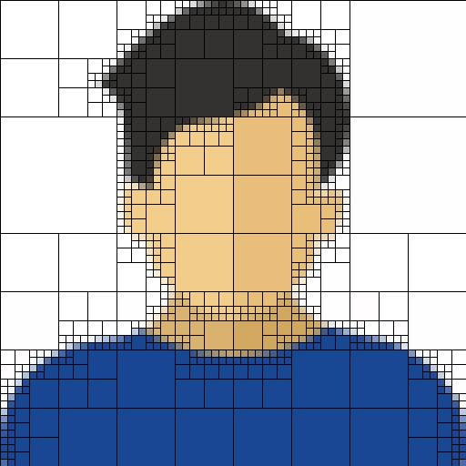

## QuadTree do Przetwarzania Obrazów

Projekt implementuje strukturę QuadTree w C# do przetwarzania obrazów. Algorytm dzieli obraz na mniejsze części, analizując szczegółowość każdej z nich. Proces dzielenia trwa, dopóki szczegółowość fragmentu obrazu nie spadnie poniżej ustalonego progu lub nie zostanie osiągnięta maksymalna głębokość drzewa.

### Główne funkcje:

- **Obliczanie Średniego Koloru:** Algorytm wylicza średni kolor dla każdej części obrazu.
- **Obliczanie Szczegółowości:** Szczegółowość jest określana na podstawie wariancji kolorów w danym fragmencie.
- **Rekurencyjne Dzielnie:** Obraz jest dzielony na mniejsze fragmenty, dopóki nie zostaną spełnione warunki zakończenia.
- **Rekonstrukcja Obrazu:** Po zbudowaniu drzewa QuadTree, obraz można zrekonstruować z wyraźnymi granicami między regionami.

### Przykład działania:

